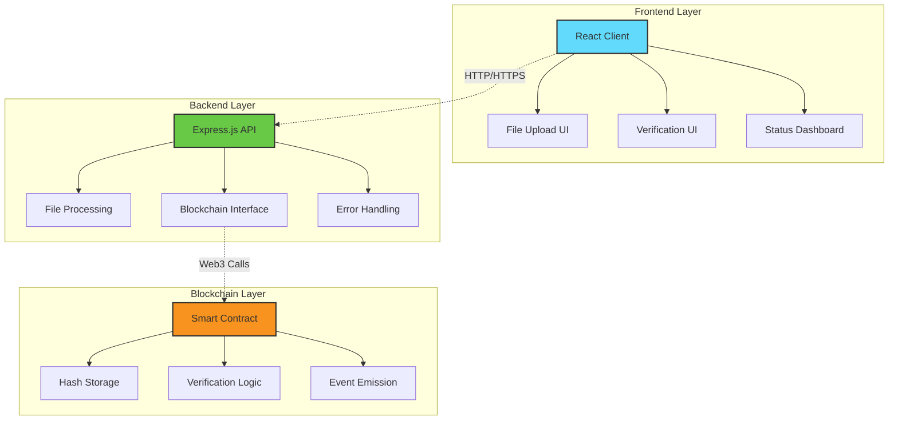
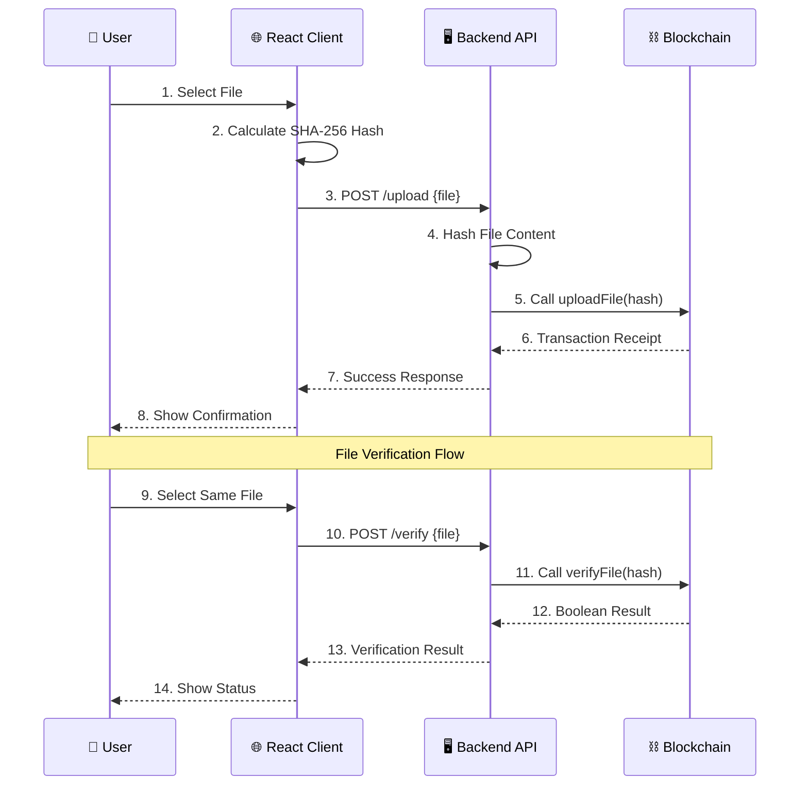

# 🔐 Blockchain File Verification System

<div align="center">


</div>

A comprehensive **decentralized file verification system** built on the Ethereum blockchain that ensures file integrity and authenticity through cryptographic hashing and immutable blockchain storage.

## 🌟 Overview

This project demonstrates a robust file verification system using the Ethereum blockchain. Users can upload file hashes to a smart contract and later verify file integrity by checking if the hash exists on the blockchain. The system provides a **tamper-proof, decentralized solution** for document authenticity verification.


## 🏗️ Architecture Overview

```
┌─────────────────┐    ┌─────────────────┐    ┌─────────────────┐
│   React Client  │    │   Node.js API   │    │ Ethereum Network│
│                 │    │                 │    │                 │
│ • File Upload   │◄──►│ • Express.js    │◄──►│ • Smart Contract│
│ • Verification  │    │ • Multer        │    │ • File Hashes   │
│ • UI/UX        │    │ • Ethers.js     │    │ • Immutable     │
└─────────────────┘    └─────────────────┘    └─────────────────┘
        │                        │                        │
        └────── HTTP Requests ────┘        └── Web3 Calls ──┘
```

## ✨ Key Features

### 🔒 **Decentralized Security**
- File hashes stored immutably on Ethereum blockchain
- No central authority can tamper with records
- Cryptographic SHA-256 hashing ensures data integrity

### 🌐 **Full-Stack Solution**
- **Smart Contract**: Solidity-based contract for hash storage
- **Backend API**: Node.js/Express server with RESTful endpoints  
- **Frontend**: Modern React application with responsive design
- **Development Environment**: Complete Hardhat setup

### 🎯 **User-Friendly Interface**
- Drag-and-drop file upload
- Real-time server status indicators
- Detailed transaction information
- Mobile-responsive design

### 🔧 **Developer Features**
- Comprehensive test suite
- Gas usage optimization
- Error handling and logging
- Health monitoring endpoints

## 🚀 Quick Start Guide

### 📋 Prerequisites

Before you begin, ensure you have the following installed:

- **Node.js** (v16 or later) - [Download here](https://nodejs.org/)
- **npm** (v8 or later) - Comes with Node.js
- **Git** - [Download here](https://git-scm.com/)

### 🔧 Installation & Setup

#### 1️⃣ **Clone the Repository**
```bash
git clone https://github.com/swasthikdevadiga1/BlockChain-SocGen.git
cd BlockChain-SocGen
```

#### 2️⃣ **Install Dependencies**
```bash
# Install root dependencies (blockchain & backend)
npm install

# Install frontend dependencies
npm install --prefix client
```

#### 3️⃣ **Start Local Blockchain** 🌐
```bash
# Terminal 1: Start Hardhat local blockchain
npm run node
```
> 💡 **Tip**: Keep this terminal running. You'll see 20 test accounts with ETH for development.

#### 4️⃣ **Deploy Smart Contract** 📜
```bash
# Terminal 2: Deploy the FileVerification contract
npm run deploy
```
> ✅ **Success**: This creates a `.env` file with contract address and private key.

#### 5️⃣ **Start Backend Server** 🖥️
```bash
# Terminal 3: Start the API server
npm start
```
> 🚀 **Running**: Backend API available at `http://localhost:4000`

#### 6️⃣ **Launch Frontend** 🌟
```bash
# Terminal 4: Start React application
npm run client
```
> 🎉 **Ready**: Open `http://localhost:3000` in your browser!

## 🏗️ System Architecture

### 📊 Component Diagram



### 🔄 Data Flow Diagram



## 🔗 API Documentation

### 📡 Backend Endpoints

The backend server provides RESTful API endpoints for blockchain interaction:

| Method | Endpoint | Description | Request | Response |
|--------|----------|-------------|---------|----------|
| `POST` | `/upload` | Upload file hash to blockchain | `multipart/form-data` | Transaction details |
| `POST` | `/verify` | Verify file against blockchain | `multipart/form-data` | Verification result |
| `GET` | `/health` | Server and blockchain status | None | Health information |
| `GET` | `/contract-info` | Contract details | None | Contract address & wallet |

### 📋 API Examples

#### 1️⃣ **Upload File**
```bash
curl -X POST \
  -F "file=@document.pdf" \
  http://localhost:4000/upload
```

**Response:**
```json
{
  "message": "File uploaded successfully to blockchain",
  "hash": "0x742d35cc...",
  "transactionHash": "0x1234567...",
  "blockNumber": 42,
  "gasUsed": "45588",
  "success": true
}
```

#### 2️⃣ **Verify File**
```bash
curl -X POST \
  -F "file=@document.pdf" \
  http://localhost:4000/verify
```

**Response:**
```json
{
  "valid": true,
  "hash": "0x742d35cc...",
  "message": "File is verified and authentic",
  "success": true
}
```

#### 3️⃣ **Health Check**
```bash
curl http://localhost:4000/health
```

**Response:**
```json
{
  "status": "healthy",
  "blockchain": {
    "connected": true,
    "network": "localhost",
    "chainId": "31337"
  },
  "contract": {
    "address": "0x5FbDB2315...",
    "walletBalance": "9999.99"
  }
}
```

## 🧪 Testing Suite

### 🔬 Smart Contract Tests

Run comprehensive smart contract tests:

```bash
# Run all tests
npm test

# Run specific test file
npx hardhat test test/FileVerification.js

# Run tests with gas reporting
REPORT_GAS=true npm test
```

**Test Coverage:**
- ✅ Contract deployment
- ✅ File hash upload functionality  
- ✅ Duplicate hash prevention
- ✅ File verification logic
- ✅ Multiple file handling
- ✅ Gas usage optimization

### 🐛 Manual Testing

#### **Test Scenario 1: Basic Upload & Verify**
```bash
# Create test file
echo "Hello Blockchain!" > test.txt

# Upload to blockchain
curl -X POST -F "file=@test.txt" http://localhost:4000/upload

# Verify file
curl -X POST -F "file=@test.txt" http://localhost:4000/verify
```

#### **Test Scenario 2: File Tampering Detection**
```bash
# Upload original file
echo "Original content" > original.txt
curl -X POST -F "file=@original.txt" http://localhost:4000/upload

# Modify file content
echo "Modified content" > original.txt

# Verify (should fail)
curl -X POST -F "file=@original.txt" http://localhost:4000/verify
```

## 🔧 Configuration & Environment

### 📄 Environment Variables

Create a `.env` file in the root directory:

```env
# Auto-generated by deployment script
CONTRACT_ADDRESS=0x5FbDB2315678afecb367f032d93F642f64180aa3
PRIVATE_KEY=0xac0974bec39a17e36ba4a6b4d238ff944bacb478cbed5efcae784d7bf4f2ff80

# Optional configurations
PORT=4000
NETWORK_URL=http://localhost:8545
```

### ⚙️ Available Scripts

| Script | Command | Description |
|--------|---------|-------------|
| Start Backend | `npm start` | Launch API server |
| Start Frontend | `npm run client` | Launch React app |
| Deploy Contract | `npm run deploy` | Deploy to localhost |
| Run Tests | `npm test` | Execute test suite |
| Start Blockchain | `npm run node` | Launch Hardhat node |
| Compile Contracts | `npm run compile` | Compile Solidity |

## 🛠️ Technology Stack

### Frontend
- **React 18** - Modern UI library with hooks
- **Axios** - HTTP client for API requests
- **CSS3** - Custom styling with gradients and animations
- **Responsive Design** - Mobile-first approach

### Backend
- **Node.js** - Runtime environment
- **Express.js** - Web application framework
- **Multer** - File upload middleware
- **Ethers.js** - Ethereum library for blockchain interaction
- **CORS** - Cross-origin resource sharing

### Blockchain
- **Solidity ^0.8.0** - Smart contract programming language
- **Hardhat** - Ethereum development environment
- **OpenZeppelin** - Security-focused contract libraries

### Development Tools
- **Hardhat Network** - Local blockchain for testing
- **Chai/Mocha** - Testing framework
- **ESLint** - Code linting
- **Nodemon** - Development server auto-restart

## 🔐 Security Features

### 🛡️ **Smart Contract Security**
- **Reentrancy Protection**: Functions are designed to prevent reentrancy attacks
- **Access Control**: No admin privileges - fully decentralized
- **Input Validation**: Strict hash format validation
- **Gas Optimization**: Efficient storage patterns to minimize costs

### 🔒 **Data Privacy**
- **Hash-Only Storage**: Only SHA-256 hashes are stored, not file content
- **No Personal Data**: Zero collection of user information
- **Client-Side Hashing**: Files never leave user's browser for privacy
- **Immutable Records**: Blockchain ensures data cannot be altered

### 🚨 **Error Handling**
- **Network Disconnection**: Graceful handling of blockchain connectivity issues
- **Transaction Failures**: Detailed error messages for failed transactions
- **File Size Limits**: 10MB maximum file size protection
- **Duplicate Prevention**: Smart contract prevents duplicate hash uploads

## 📊 Performance Metrics

### ⛽ **Gas Usage**
- **Contract Deployment**: ~223,466 gas
- **Upload File Hash**: ~45,588 gas
- **Verify File Hash**: ~23,000 gas (view function)

### 🚀 **Response Times**
- **File Upload**: 2-5 seconds (including blockchain confirmation)
- **File Verification**: <1 second (read-only operation)
- **Health Check**: <100ms

## 🌍 Deployment Guide

### 🏠 **Local Development**
Already covered in the Quick Start Guide above.

### ☁️ **Production Deployment**

#### **Backend Deployment (Railway/Heroku)**
```bash
# Build for production
npm run build

# Set environment variables
export CONTRACT_ADDRESS=your_contract_address
export PRIVATE_KEY=your_private_key
export NETWORK_URL=https://mainnet.infura.io/v3/YOUR_KEY

# Deploy
git push heroku main
```

#### **Frontend Deployment (Vercel/Netlify)**
```bash
cd client
npm run build

# Deploy build folder to hosting service
```

#### **Smart Contract Deployment (Mainnet)**
```bash
# Update hardhat.config.js with mainnet settings
npx hardhat run scripts/deploy.js --network mainnet
```

> ⚠️ **Important**: Use environment variables for private keys in production. Never commit private keys to version control.

## 🔄 How It Works

### 1️⃣ **File Processing**
```
User File → SHA-256 Hash → Blockchain Storage
```

### 2️⃣ **Hash Generation**
- Files are processed client-side using SHA-256 algorithm
- Generates unique 256-bit fingerprint for each file
- Same file always produces same hash (deterministic)

### 3️⃣ **Blockchain Storage**
```solidity
mapping(bytes32 => bool) public fileHashes;

function uploadFile(bytes32 hash) public {
    require(!fileHashes[hash], "File already uploaded");
    fileHashes[hash] = true;
    emit FileUploaded(hash);
}
```

### 4️⃣ **Verification Process**
- Calculate hash of file to verify
- Query blockchain for hash existence
- Return verification result

## 📈 Project Roadmap

### ✅ **Completed Features**
- [x] Basic file verification system
- [x] Smart contract deployment
- [x] Frontend user interface
- [x] Backend API development
- [x] Comprehensive testing suite
- [x] Error handling & logging

### 🚧 **In Progress**
- [ ] MetaMask integration
- [ ] File metadata storage
- [ ] Bulk file verification
- [ ] Advanced analytics dashboard

### 🔮 **Future Enhancements**
- [ ] IPFS integration for file storage
- [ ] Multi-chain support (Polygon, Arbitrum)
- [ ] API rate limiting
- [ ] File expiration system
- [ ] Digital signatures integration
- [ ] Audit trail reporting
- [ ] Mobile application

## 🤝 Contributing

We welcome contributions! Please follow these steps:

### 🔧 **Development Setup**
1. Fork the repository
2. Create feature branch: `git checkout -b feature/amazing-feature`
3. Follow coding standards and add tests
4. Commit changes: `git commit -m 'Add amazing feature'`
5. Push to branch: `git push origin feature/amazing-feature`
6. Create Pull Request

### 📋 **Contribution Guidelines**
- Write clear, concise commit messages
- Add tests for new features
- Update documentation as needed
- Follow existing code style
- Ensure all tests pass

### 🐛 **Bug Reports**
Please include:
- Operating system and version
- Node.js version
- Clear reproduction steps
- Expected vs actual behavior
- Screenshots if applicable

## 🆘 Troubleshooting

### ❓ **Common Issues**

#### **"Server is not connected"**
```bash
# Check if backend server is running
curl http://localhost:4000/health

# Restart backend server
npm start
```

#### **"Contract not deployed"**
```bash
# Redeploy smart contract
npm run deploy

# Check .env file exists with CONTRACT_ADDRESS
cat .env
```

#### **"Transaction failed"**
- Ensure Hardhat node is running
- Check wallet has sufficient ETH
- Verify network connection
- Try with different file

#### **"High gas usage"**
- Use smaller files for testing
- Check network congestion
- Consider gas price optimization

## 📞 Support & Contact

- 🐛 **Issues**: [GitHub Issues](https://github.com/swasthikdevadiga1/BlockChain-SocGen/issues)
- 💬 **Discussions**: [GitHub Discussions](https://github.com/swasthikdevadiga1/BlockChain-SocGen/discussions)
- 📧 **Email**: Contact repository owner
- 📖 **Documentation**: See this README and inline code comments

## 📄 License

This project is licensed under the **MIT License** - see the [LICENSE](LICENSE) file for details.

## 🙏 Acknowledgments

- **OpenZeppelin** for smart contract security patterns
- **Hardhat** for excellent development tools
- **React** team for the amazing frontend framework
- **Ethereum** community for blockchain infrastructure
- **Contributors** who helped improve this project

---

<div align="center">

**⭐ Star this project if you find it helpful!**

Made with ❤️ by the blockchain community

</div>
