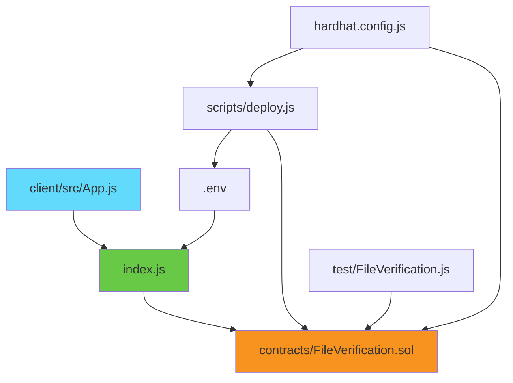

# Project Structure Documentation

This document provides a detailed overview of the project structure and file organization.

## 📁 Root Directory Structure

```
BlockChain-SocGen/
├── 📄 README.md              # Main project documentation
├── 📄 package.json           # Node.js dependencies & scripts
├── 📄 hardhat.config.js      # Hardhat configuration
├── 📄 index.js               # Backend server (Express.js)
├── 📄 .env                   # Environment variables (auto-generated)
├── 📄 .gitignore            # Git ignore rules
├── 📄 LICENSE               # MIT License
├── 📄 setup.sh              # Development setup script
└── 📄 STRUCTURE.md          # This file

├── 📁 contracts/            # Smart contracts
│   ├── 📄 FileVerification.sol    # Main verification contract
│   └── 📄 Lock.sol               # Example contract (can be removed)

├── 📁 scripts/              # Deployment & utility scripts
│   └── 📄 deploy.js              # Contract deployment script

├── 📁 test/                 # Test files
│   ├── 📄 FileVerification.js    # Smart contract tests
│   └── 📄 Lock.js               # Example tests (can be removed)

├── 📁 client/               # React frontend application
│   ├── 📄 package.json          # Frontend dependencies
│   ├── 📄 README.md            # Frontend documentation
│   │
│   ├── 📁 public/              # Static assets
│   │   ├── 📄 index.html           # HTML template
│   │   ├── 📄 favicon.ico          # Browser icon
│   │   ├── 📄 manifest.json        # PWA manifest
│   │   └── 📄 robots.txt           # Search engine rules
│   │
│   └── 📁 src/                 # Source code
│       ├── 📄 App.js               # Main React component
│       ├── 📄 App.css              # Main styles
│       ├── 📄 index.js             # React entry point
│       ├── 📄 index.css            # Global styles
│       └── 📄 App.test.js          # Component tests

├── 📁 ignition/             # Hardhat Ignition (optional)
│   └── 📁 modules/
│       └── 📄 Lock.js

└── 📁 images/               # Documentation images
    └── 📄 Screenshot from *.png    # UI screenshots
```

## 🔧 Key Files Description

### Backend Files

- **`index.js`** - Main Express.js server handling file upload/verification
- **`package.json`** - Project configuration, dependencies, and scripts
- **`.env`** - Environment variables (CONTRACT_ADDRESS, PRIVATE_KEY)

### Smart Contracts

- **`contracts/FileVerification.sol`** - Core smart contract for hash storage and verification
- **`scripts/deploy.js`** - Automated deployment script with environment setup

### Frontend Files

- **`client/src/App.js`** - Main React component with file upload UI
- **`client/src/App.css`** - Modern CSS with gradients and responsive design
- **`client/package.json`** - Frontend-specific dependencies

### Configuration Files

- **`hardhat.config.js`** - Hardhat network and compiler configuration
- **`.gitignore`** - Files/folders to exclude from version control
- **`setup.sh`** - Automated development environment setup

## 🚀 Script Commands

### Root Package Scripts

```json
{
  "start": "node index.js",           // Start backend server
  "dev": "nodemon index.js",          // Start with auto-reload
  "test": "npx hardhat test",         // Run smart contract tests
  "deploy": "npx hardhat run scripts/deploy.js --network localhost",
  "compile": "npx hardhat compile",   // Compile contracts
  "node": "npx hardhat node",         // Start local blockchain
  "client": "npm start --prefix client",      // Start React app
  "client:build": "npm run build --prefix client"  // Build for production
}
```

### Client Package Scripts

```json
{
  "start": "react-scripts start",     // Development server
  "build": "react-scripts build",     // Production build
  "test": "react-scripts test",       // Run React tests
  "eject": "react-scripts eject"      // Eject from Create React App
}
```

## 🔄 Development Workflow

### 1. Initial Setup
```bash
./setup.sh                    # Run setup script
# OR manually:
npm install                   # Install backend deps
npm install --prefix client   # Install frontend deps
```

### 2. Start Development Environment
```bash
# Terminal 1: Blockchain
npm run node

# Terminal 2: Smart Contract
npm run deploy

# Terminal 3: Backend API
npm start

# Terminal 4: Frontend
npm run client
```

### 3. Testing
```bash
npm test                      # Smart contract tests
npm run client test           # Frontend tests (if any)
```

## 📊 File Relationships



## 🔐 Security Considerations

### Environment Variables
- **`.env`** contains sensitive data (private keys)
- **Never commit `.env`** to version control
- **Use different keys** for production deployment

### Smart Contract
- **No admin privileges** - fully decentralized
- **Input validation** prevents invalid hash formats
- **Gas optimization** for cost efficiency

### API Security
- **File size limits** (10MB maximum)
- **CORS enabled** for cross-origin requests
- **Error handling** prevents information leakage

## 📈 Performance Notes

### Gas Usage
- **Contract deployment**: ~223,466 gas
- **File upload**: ~45,588 gas per hash
- **File verification**: ~23,000 gas (read-only)

### Response Times
- **Upload**: 2-5 seconds (blockchain confirmation)
- **Verify**: <1 second (local blockchain read)

## 🛠️ Customization Options

### Adding New Features
1. **Smart Contract**: Modify `contracts/FileVerification.sol`
2. **Backend API**: Add routes in `index.js`
3. **Frontend UI**: Update `client/src/App.js`

### Configuration Changes
- **Network settings**: Update `hardhat.config.js`
- **Port numbers**: Modify `package.json` scripts
- **Styling**: Edit `client/src/App.css`

## 📚 External Dependencies

### Backend
- **express**: Web server framework
- **ethers**: Blockchain interaction
- **multer**: File upload handling
- **cors**: Cross-origin requests

### Frontend  
- **react**: UI library
- **axios**: HTTP client for API calls

### Development
- **hardhat**: Ethereum development environment
- **chai/mocha**: Testing framework

This structure provides a solid foundation for a production-ready blockchain file verification system.
